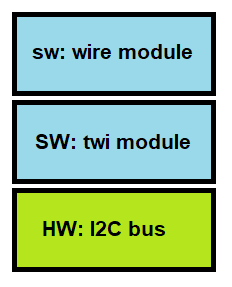

# TWI
Timeout added to Arduino I2C (Wire or actually twi) implementation.

## Introduction
The standard I2C functions on Arduino can _hang_.
When `endTransaction()` does not get an _ack_ from the slave, the function does not return.
This is an artefact ("bug"?) of the avr _library 1.8.2_ that comes with _Arduino IDE 1.8.10_ (January 2020).

## Problem
In Arduino, the stock I2C implementation is in the `Wire` module. 
The `Wire` module builts on top of the `twi` module ("two wire interface").



The "hang" problem of `Wire.endTransaction()` is actually in the implementation of the `twi` module, 
more specifically in the `twi_writeTo()` function.

That function contains a while loop without time-out:

```
  // wait for write operation to complete
  while(wait && (TWI_MTX == twi_state)){
    continue;
  }
```

## Fix

I have changed the infinite while loop to (I only added lines, and those are tagged with `MAARTEN`)

```
  // wait for write operation to complete
  now=micros();                                      // MAARTEN
  while(wait && (TWI_MTX == twi_state)){
    if( micros()-now > twi_timeout_us ) return 5;    // MAARTEN
    continue;
  }
```

The variable `twi_timeout_us` is introduced by me by adding it to the top of the file

```
static uint32_t twi_timeout_us = 100000L; // 100ms   // MAARTEN
void twi_timeout_set_us(uint32_t timeout_us) {       // MAARTEN
    twi_timeout_us= timeout_us;                      // MAARTEN
}                                                    // MAARTEN
                                                     // MAARTEN
uint32_t twi_timeout_get_us(void) {                  // MAARTEN
    return twi_timeout_us;                           // MAARTEN
}                                                    // MAARTEN
```


## Diff

This project gives you a [utility](utility) directory with the patched `twi` module.
 - the original [twi.h](utility/twi.h.org.txt) from avr library 1.8.2 that comes with Arduino IDE 1.8.10 (January 2020).
 - the original [twi.c](utility/twi.c.org.txt) from avr library 1.8.2 that comes with Arduino IDE 1.8.10 (January 2020).
 - the patched [twi.h](utility/twi.h) with the time-out added
 - the patched [twi.c](utility/twi.c) with the time out added
 
These images show the differences
 - for `twi.h`: [twi.h](twi.h.diff.png)
 - for `twi.c`: [twi.c 1](twi.c.diff1.png) and [twi.c 2](twi.c.diff2.png)
 
 ## Use
 
 If you want to use the fix
  - Download the zip file.
  - Copy the `utility` directory from this project over your utility directory. You find your utility directory either in 
    `C:\Users\<you>\AppData\Local\Arduino15\packages\arduino\hardware\avr\1.8.2\libraries\Wire\src\utility`
    or in 
    `C:\Program Files (x86)\Arduino\hardware\arduino\avr\libraries\Wire\src\utility`.
  - Tip: add `#warning PATCHED` to `twi.c` so that you can check (when building your project) that indeed the patch is used. 
    It also (constantly) reminds you, that you have a patch.
  - It is wise to first do a diff if you have a different version than 
    avr library 1.8.2 that comes with Arduino IDE 1.8.10 (January 2020).
  - If you upgrade Arduino (libs) this fix gets overwritten, so you have to redo it.
  - Note that Wire has these errors by default
    - 0:success
    - 1:data too long to fit in transmit buffer
    - 2:received NACK on transmit of address
    - 3:received NACK on transmit of data
    - 4:other error
  - this library now adds one more
    - 5:timeout
 
 (end of doc)

